### Flume

***概念***:

Cloudera提供的高可用、高可靠、分布式的海量日志***收集***、***整合和传输***的系统。

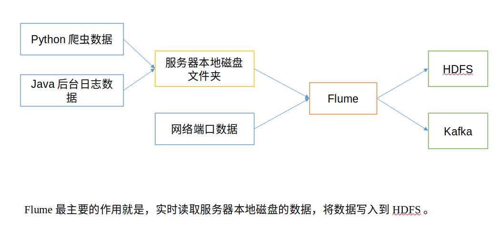


***基础架构:***


Agent

一个JVM进程 以***Event***的形式将数据从源头送至目的，包含三个部分。

- Source: 

  负责接收数据到Flume Agent 组件。

  (包括 avro、thrift、exec、jms、spooling directory、netcat、sequence generator、syslog、http、legacy 等类型。)

- Sink: 

  不断轮询Channel 中 的Event。并且批量地溢出他们。并将这些Event批量处理写入到存储或索引系统(或者发送到另一个Flume Agent)

  hdfs、logger、avro、thrift、ipc、file、HBase、solr、自定义。

- Channel: 

  位于Source和Sink之间的缓冲区，所以支持运作在不同的***速率***。而且Channel是线程安全的 。可以同时处理几个Source的***写入*** 和 Sink的***读取***操作。

  分类: Memory Channel 和 File Channel

  - Memory: 内存中的队列。容易丢失。
  - File Memory: 事件写到了磁盘上。不易丢失。

- Evnet: 

  Flume传输的基本***传输单元***。由Header 和 Body 租成。

  Header: 存放Event的一些属性 (K=V结构) 

  Body: 存放数据。

  

- Interceptors:

  在source将event放入到channel之前，调用拦截器对event进行拦截和处理。

- Channel Selectors: 

  当***一个***source对接***多个***channel时，由 Channel Selectors选取channel将event存入。

- Sink Processors:

  当多个sink从一个channel取数据时，为了保证数据的***顺序***，由sink processor从多个sink中挑选一个sink，由这个sink干活


***安装与部署***

官网: http://flume.apache.org/。他是一个客户端，所以直接安装就可以了。

配置手册: http://flume.apache.org/FlumeUserGuide.html

0.9 之前称为flume.og 

0.9之后称为flume.ng


***案例:***

需求

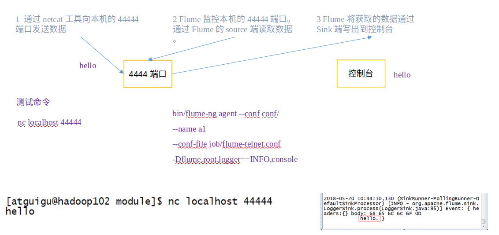

安装netcat工具

```shell
sudo yum install -y nc
```

创建Flume Agent 配置文件flume-netcat-logger.conf

```shell
# Name the components on this agent
a1.sources = r1
a1.sinks = k1
a1.channels = c1

# Describe/configure the source
a1.sources.r1.type = netcat
a1.sources.r1.bind = hadoop102
a1.sources.r1.port = 44444

# Describe the sink
a1.sinks.k1.type = logger

# Use a channel which buffers events in memory
a1.channels.c1.type = memory
a1.channels.c1.capacity = 10000
a1.channels.c1.transactionCapacity = 1000

# Bind the source and sink to the channel
a1.sources.r1.channels = c1
a1.sinks.k1.channel = c1
```

开启Flume监听端口

第一种写法：

```shell
flume-ng agent --conf conf/ --name a1 --conf-file flume-netcat-logger.conf -Dflume.root.logger=INFO,console
```

第二种写法：

```shell
flume-ng agent -c conf/ -n a1 –f flume-netcat-logger.conf -Dflume.root.logger=INFO,console
```

> conf/-c：表示配置文件存储在conf/目录
>
> - --name/-n：表示给agent起名为a1
>
> - --conf-file/-f：flume本次启动读取的配置文件是在job文件夹下的flume-telnet.conf文件。
>
> - -Dflume.root.logger=INFO,console ：-D表示flume运行时动态修改flume.root.logger参数属性值，并将控制台日志打印级别设置为INFO级别。日志级别包括:log、info、warn、error。

使用netcat工具向本机的44444端口发送内容

```shell
nc hadoop102 44444
```


案例一: 实时监控单个文件

实时监控Hive日志 并上传到HDFS中

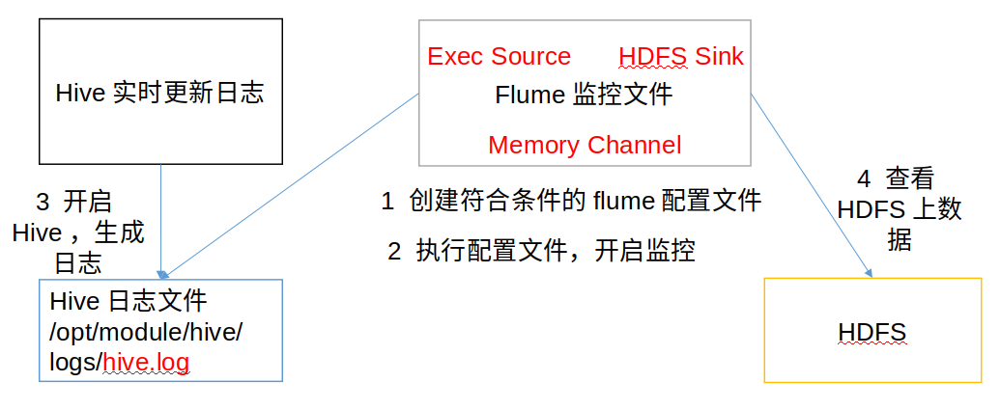

flume-file-hdfs.conf

```shell
# Name the components on this agent
a2.sources = r2
a2.sinks = k2
a2.channels = c2

# Describe/configure the source
a2.sources.r2.type = exec
a2.sources.r2.command = tail -F /opt/module/hive/logs/hive.log
a2.sources.r2.shell = /bin/bash -c

# Describe the sink
a2.sinks.k2.type = hdfs
a2.sinks.k2.hdfs.path = hdfs://hadoop102:9000/flume/%Y%m%d/%H
#上传文件的前缀
a2.sinks.k2.hdfs.filePrefix = logs-
#是否按照时间滚动文件夹
a2.sinks.k2.hdfs.round = true
#多少时间单位创建一个新的文件夹
a2.sinks.k2.hdfs.roundValue = 1
#重新定义时间单位
a2.sinks.k2.hdfs.roundUnit = hour
#是否使用本地时间戳
#说明: 
#对于所有与时间相关的转义序列，Event Header中必须存在以 “timestamp”的key（除非hdfs.useLocalTimeStamp设置为true，此方法会使用TimestampInterceptor自动添加timestamp）
a2.sinks.k2.hdfs.useLocalTimeStamp = true
#积攒多少个Event才flush到HDFS一次
a2.sinks.k2.hdfs.batchSize = 100
#多久生成一个新的文件
a2.sinks.k2.hdfs.rollInterval = 60
#设置每个文件的滚动大小
a2.sinks.k2.hdfs.rollSize = 134217700
#文件的滚动与Event数量无关
a2.sinks.k2.hdfs.rollCount = 0

# Use a channel which buffers events in memory
a2.channels.c2.type = memory
a2.channels.c2.capacity = 10000
a2.channels.c2.transactionCapacity = 1000

# Bind the source and sink to the channel
a2.sources.r2.channels = c2
a2.sinks.k2.channel = c2
```

> 注：要想读取Linux系统中的文件，就得按照Linux命令的规则执行命令。由于Hive日志在Linux系统中所以读取文件的类型选择：exec即execute执行的意思。表示执行Linux命令来读取文件。


案例二: 监控多个新文件

监控整个目录的文件 并上传到HDFS

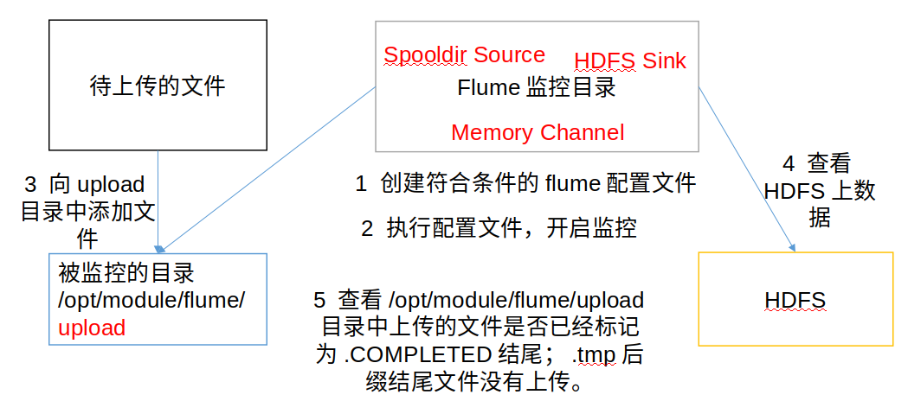

flume-dir-hdfs.conf

```shell
a3.sources = r3
a3.sinks = k3
a3.channels = c3

# Describe/configure the source
a3.sources.r3.type = spooldir
a3.sources.r3.spoolDir = /opt/module/flume/upload
a3.sources.r3.fileSuffix = .COMPLETED
#忽略所有以.tmp结尾的文件，不上传
a3.sources.r3.ignorePattern = \\S*\\.tmp

# Describe the sink
a3.sinks.k3.type = hdfs
a3.sinks.k3.hdfs.path = hdfs://hadoop102:9000/flume/upload/%Y%m%d/%H
#上传文件的前缀
a3.sinks.k3.hdfs.filePrefix = upload-
#是否按照时间滚动文件夹
a3.sinks.k3.hdfs.round = true
#多少时间单位创建一个新的文件夹
a3.sinks.k3.hdfs.roundValue = 1
#重新定义时间单位
a3.sinks.k3.hdfs.roundUnit = hour
#是否使用本地时间戳
a3.sinks.k3.hdfs.useLocalTimeStamp = true
#积攒多少个Event才flush到HDFS一次
a3.sinks.k3.hdfs.batchSize = 100
#设置文件类型，可支持压缩
a3.sinks.k3.hdfs.fileType = DataStream
#多久生成一个新的文件
a3.sinks.k3.hdfs.rollInterval = 60
#设置每个文件的滚动大小大概是128M
a3.sinks.k3.hdfs.rollSize = 134217700
#文件的滚动与Event数量无关
a3.sinks.k3.hdfs.rollCount = 0

# Use a channel which buffers events in memory
a3.channels.c3.type = memory
a3.channels.c3.capacity = 10000
a3.channels.c3.transactionCapacity = 1000

# Bind the source and sink to the channel
a3.sources.r3.channels = c3
a3.sinks.k3.channel = c3
```

> 说明：在使用Spooling Directory Source时
>
> 不要在监控目录中创建并持续修改文件
>
> 上传完成的文件会以.COMPLETED结尾
>
> 被监控文件夹每500毫秒扫描一次文件变动


案例三: 实时监控多个文件

监听整个目录的实时追加文件 并上传到HDFS

> ***Exec source***适用于监控一个***实时追加的文件***，但不能保证数据不***丢失***；
>
> ***Spooldir Source***能够保证数据不丢失，且能够实现断点续传，但***延迟较高***，***不能实时***监控；
>
> ***taildir Source***既能够实现断点续传，又可以保证数据不丢失，还能够进行时监控。( taildir YES! )

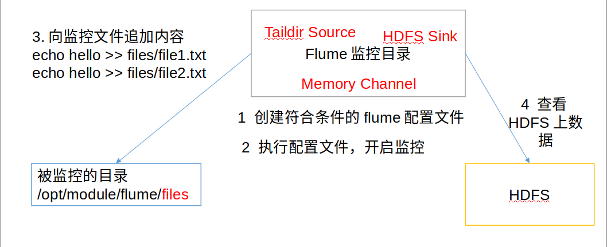

flume-taildir-hdfs.conf

```shell
a3.sources = r3
a3.sinks = k3
a3.channels = c3

# Describe/configure the source
a3.sources.r3.type = TAILDIR
a3.sources.r3.positionFile = /opt/module/flume/tail_dir.json
a3.sources.r3.filegroups = f1
a3.sources.r3.filegroups.f1 = /opt/module/flume/files/file.*

# Describe the sink
a3.sinks.k3.type = hdfs
a3.sinks.k3.hdfs.path = hdfs://hadoop102:9000/flume/upload/%Y%m%d/%H
#上传文件的前缀
a3.sinks.k3.hdfs.filePrefix = upload-
#是否按照时间滚动文件夹
a3.sinks.k3.hdfs.round = true
#多少时间单位创建一个新的文件夹
a3.sinks.k3.hdfs.roundValue = 1
#重新定义时间单位
a3.sinks.k3.hdfs.roundUnit = hour
#是否使用本地时间戳
a3.sinks.k3.hdfs.useLocalTimeStamp = true
#积攒多少个Event才flush到HDFS一次
a3.sinks.k3.hdfs.batchSize = 100
#设置文件类型，可支持压缩
a3.sinks.k3.hdfs.fileType = DataStream
#多久生成一个新的文件
a3.sinks.k3.hdfs.rollInterval = 60
#设置每个文件的滚动大小大概是128M
a3.sinks.k3.hdfs.rollSize = 134217700
#文件的滚动与Event数量无关
a3.sinks.k3.hdfs.rollCount = 0

# Use a channel which buffers events in memory
a3.channels.c3.type = memory
a3.channels.c3.capacity = 10000
a3.channels.c3.transactionCapacity = 1000

# Bind the source and sink to the channel
a3.sources.r3.channels = c3
a3.sinks.k3.channel = c3
```

> Taildir Source维护了一个json格式的position File，其会定期的往position File中更新每个文件读取到的最新的位置，因此能够实现断点续传。Position File的格式如下：
>
> {"inode":2496272,"pos":12,"file":"/opt/module/flume/files/file1.txt"}
>
> {"inode":2496275,"pos":12,"file":"/opt/module/flume/files/file2.txt"}
>
> 注：Linux中储存文件元数据的区域就叫做i***node***，每个inode都有一个***号码***，操作系统用inode号码来识别不同的文件，Unix/Linux系统内部不使用文件名，而使用inode号码


Flume进阶

- Flume事务

  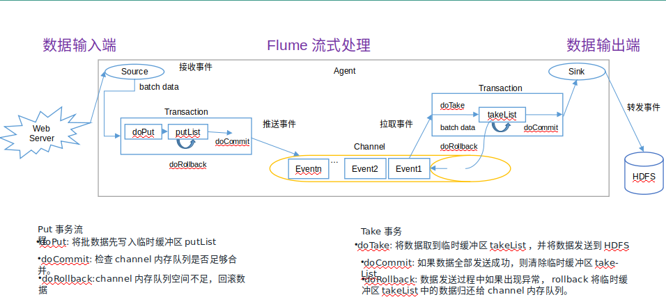

- Flume Agent 内部原理

  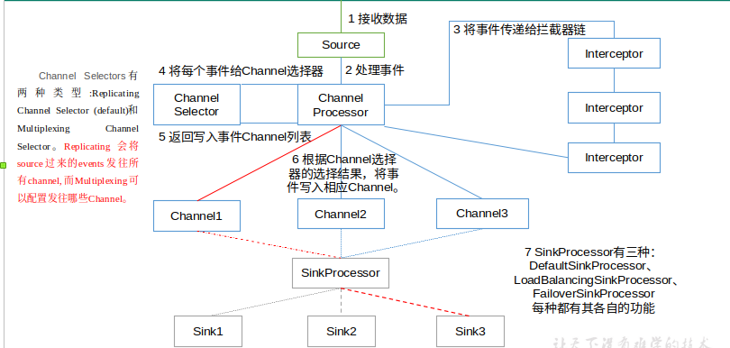

  重要组件

  1. ChannelSelector (分为 Replicating 和 Multiplexing)
  2. SinkProcessor (分为 DefaultSinkPeocessor LoadBalancing 和 FailoverSinkProcessor)

- Flume  拓扑结构

  简单串联

  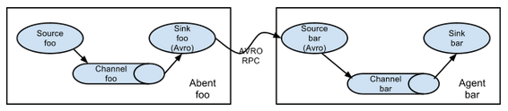

  复制和多路复用

  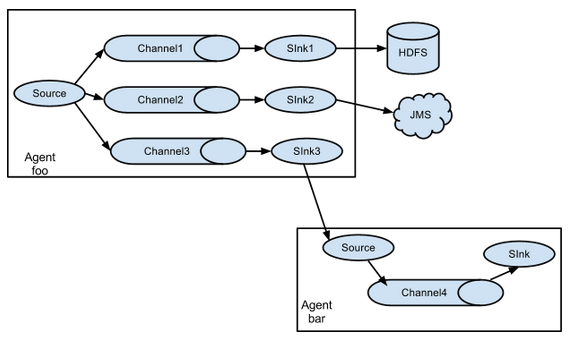

  负载均衡和故障转移

  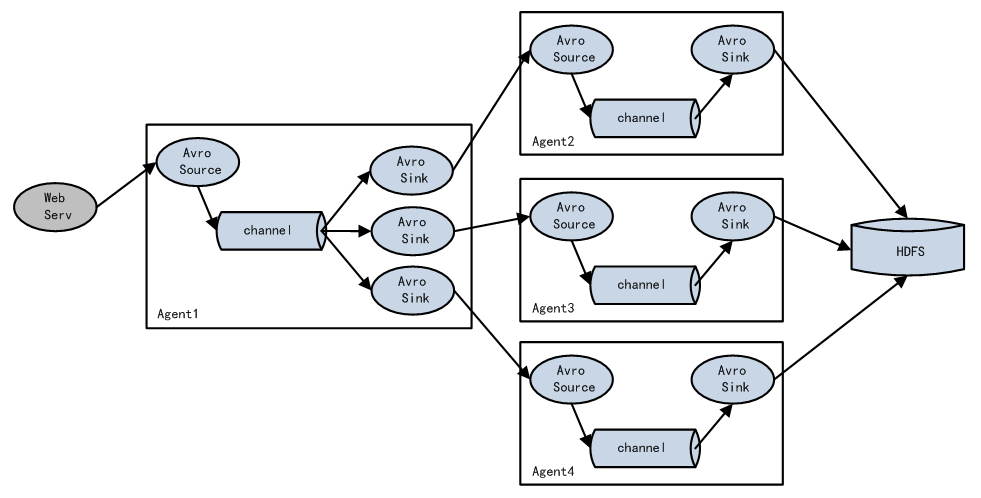

  聚合 (常用且实用)

  每个服务器都部署一个Flume采集日志 传输到一个集中收集日志的Flume  再由此服务器传输到HDFS, Hive, HBase 等 进行日志分析.

  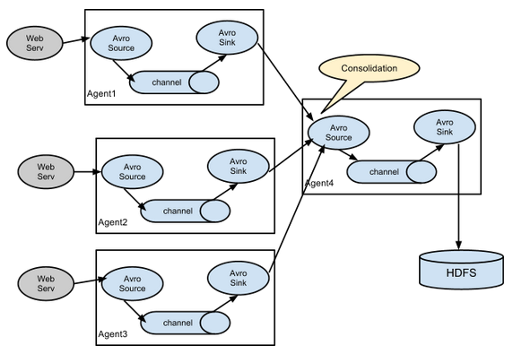


事务

- 数量关系:

  batchSize: 每个***Source和Sink***都可以配置一个batchSize的参数, 代表一次性到channel中 put或者take 多少个event.

  > bathch ***<=*** transactionCapaticy   
  >
  > transactionCapacity <= capacity

  transactionCapacity: putList 和 takeList的初始值

  capacity: channel 中创建的event的容量大小

  putList: source 向 channel放入数据的***缓冲区*** , 在固定初始化时, 需要根据一个固定的size(在channel中设置)初始化.

  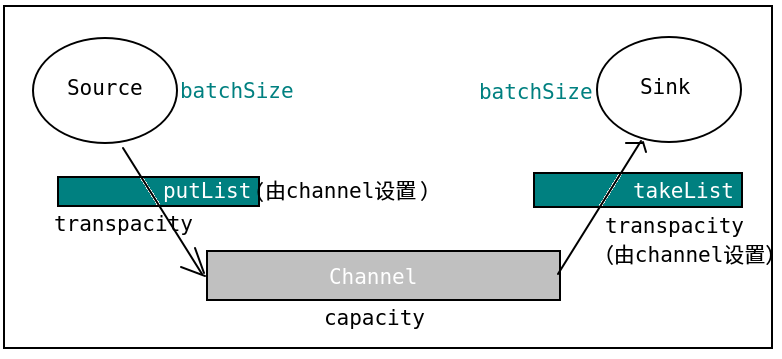

- put事务流程

  source将封装好的event

  1. 先放到putlist中, 放入完成后 
  2. ***一次性***的commit() 这批event就可以写入到channnel 
  3. 写入完成后 ***清空putlist*** 开始下一批数据的写入

  > 若在放入putlist的时候发生了异常 那么执行rollback() 直接清空putList() 

- take事务流程

  不断从channel中拉取event

  1. 先放入takeList中
  2. 当一个batchSize的event***全部拉取到***takeList中之后，执行commit() 并清空takeList
  3. 此时由sink执行***写出处理***

  > 若在写出的时候发生了异常 执行回滚 将takeList中的所有event全部会滚到channel中


AvroSource (多个Agent串联的场景)

- 场景:

  如果AgentA需要将Event对象发送到***其他的agent进程*** 中！
  AgentA的sink，必须为***AvroSink***,其他的agent在接收时，必须选择***AvroSource***！

- 组件:

  1. avrosource: 用于监听一个avro的端口 从另一个avro客户端***接受event***

     配置:

     type	–	The component type name, needs to be avro
     bind	–	hostname or IP address to listen on
     port	–	Port # to bind to

  2. avrosink: 将event转化为avro格式的event ***发送***到指定的主机和端口

     配置:

     type	–	The component type name, needs to be avro.
     hostname	–	The hostname or IP address to bind to.
     port	–	The port # to listen on.

案例:

hadoop101，agent1:   netcatsource---memorychannel--arvosink
hadoop101，agent2:   avrosource----memorychannel--loggersink

```xml
#agent1
#a1是agent的名称，a1中定义了一个叫r1的source，如果有多个，使用空格间隔
a1.sources = r1
a1.sinks = k1
a1.channels = c1
#组名名.属性名=属性值
a1.sources.r1.type=netcat
a1.sources.r1.bind=hadoop101
a1.sources.r1.port=44444

#定义sink
a1.sinks.k1.type=avro
a1.sinks.k1.hostname=hadoop102
a1.sinks.k1.port=33333
#定义chanel
a1.channels.c1.type=memory
a1.channels.c1.capacity=1000

#连接组件 同一个source可以对接多个channel，一个sink只能从一个channel拿数据！
a1.sources.r1.channels=c1
a1.sinks.k1.channel=c1

--------------------------------------------------------

#agent2
#a1是agent的名称，a1中定义了一个叫r1的source，如果有多个，使用空格间隔
a1.sources = r1
a1.sinks = k1
a1.channels = c1
#组名名.属性名=属性值
a1.sources.r1.type=avro
a1.sources.r1.bind=hadoop102
a1.sources.r1.port=33333

#定义sink
a1.sinks.k1.type=logger

#定义chanel
a1.channels.c1.type=memory
a1.channels.c1.capacity=1000

#连接组件 同一个source可以对接多个channel，一个sink只能从一个channel拿数据！
a1.sources.r1.channels=c1
a1.sinks.k1.channel=c1
```


Multiplexing Channel Selector

根据event header 属性, 参考用户自己配置映射信息, 将event发送到指定的channel。

```shell
a1.sources = r1
a1.channels = c1 c2 c3 c4
a1.sources.r1.selector.type = multiplexing
a1.sources.r1.selector.header = state
a1.sources.r1.selector.mapping.CZ = c1
a1.sources.r1.selector.mapping.US = c2 c3
a1.sources.r1.selector.default = c4
```

r1中每个event根据header中key为state的值，进行选择.

如果state=CZ,这类event发送到c1

如果state=US,这类event发送到c2，c3,

如果state=其他，发送到c4

案例:

agent1:  在hadoop102

```xml
#a1是agent的名称，a1中定义了一个叫r1的source，如果有多个，使用空格间隔
a1.sources = r1
a1.sinks = k1 k2
a1.channels = c1 c2 
#组名名.属性名=属性值
a1.sources.r1.type=exec
a1.sources.r1.command=tail -f /home/atguigu/test
#声明r1的channel选择器
a1.sources.r1.selector.type = multiplexing
a1.sources.r1.selector.header = state
a1.sources.r1.selector.mapping.CZ = c1
a1.sources.r1.selector.mapping.US = c2

#使用拦截器为event加上某个header
a1.sources.r1.interceptors = i1
a1.sources.r1.interceptors.i1.type = static
a1.sources.r1.interceptors.i1.key = state
a1.sources.r1.interceptors.i1.value = CZ

#定义chanel
a1.channels.c1.type=memory
a1.channels.c1.capacity=1000

a1.channels.c2.type=memory
a1.channels.c2.capacity=1000

##定义sink
a1.sinks.k1.type=avro
a1.sinks.k1.hostname=hadoop101
a1.sinks.k1.port=33333

a1.sinks.k2.type=avro
a1.sinks.k2.hostname=hadoop103
a1.sinks.k2.port=33333

#连接组件 同一个source可以对接多个channel，一个sink只能从一个channel拿数据！
a1.sources.r1.channels=c1 c2
a1.sinks.k1.channel=c1
a1.sinks.k2.channel=c2

-------------------------------------------------------

a1.sources = r1
a1.sinks = k1
a1.channels = c1
#组名名.属性名=属性值
a1.sources.r1.type=avro
a1.sources.r1.bind=hadoop101
a1.sources.r1.port=33333


#定义sink
a1.sinks.k1.type=logger

#定义chanel
a1.channels.c1.type=memory
a1.channels.c1.capacity=1000

#连接组件 同一个source可以对接多个channel，一个sink只能从一个channel拿数据！
a1.sources.r1.channels=c1
a1.sinks.k1.channel=c1

-------------------------------------------------------

a1.sources = r1
a1.sinks = k1
a1.channels = c1
#组名名.属性名=属性值
a1.sources.r1.type=avro
a1.sources.r1.bind=hadoop103
a1.sources.r1.port=33333

#定义sink
a1.sinks.k1.type=logger


#定义chanel
a1.channels.c1.type=memory
a1.channels.c1.capacity=1000

a1.sources.r1.channels=c1
a1.sinks.k1.channel=c1
```


Channel Selector

- Replicating Channel Selector

  复制的Channel选择器(默认的选择器)  

  > 当一个source使用此选择器选择多个channel时, source会将event在每个channel都复制一份
  >
  > 当向可选的channel写入event时 即使发生异常 也会***忽略***

- File Roll Sink

  存储event到本地文件系统

  必需配置：
  type					 –	The component type name, needs to be file_roll.
  sink.directory	 –	The directory where files will be stored


案例: 

(execsource----memory channel1----avrosink1)------(arvosource----memory channel----loggersink)
					 ----memory channel2----avrosink2)------(arvosource----memory channel----filerollsink)

agent1: 在hadoop102

```xml
#a1是agent的名称，a1中定义了一个叫r1的source，如果有多个，使用空格间隔
a1.sources = r1
a1.sinks = k1 k2
a1.channels = c1 c2 
#组件名.属性名=属性值
a1.sources.r1.type=exec
a1.sources.r1.command=tail -f /home/atguigu/test
#声明r1的channel选择器
a1.sources.r1.selector.type = replicating

#定义chanel
a1.channels.c1.type=memory
a1.channels.c1.capacity=1000

a1.channels.c2.type=memory
a1.channels.c2.capacity=1000

##定义sink
a1.sinks.k1.type=avro
a1.sinks.k1.hostname=hadoop101
a1.sinks.k1.port=33333

a1.sinks.k2.type=avro
a1.sinks.k2.hostname=hadoop103
a1.sinks.k2.port=33333

#连接组件 同一个source可以对接多个channel，一个sink只能从一个channel拿数据！
a1.sources.r1.channels=c1 c2
a1.sinks.k1.channel=c1
a1.sinks.k2.channel=c2

-------------------------------------------------------

a1.sources = r1
a1.sinks = k1
a1.channels = c1
#组名名.属性名=属性值
a1.sources.r1.type=avro
a1.sources.r1.bind=hadoop101
a1.sources.r1.port=33333


#定义sink
a1.sinks.k1.type=logger

#定义chanel
a1.channels.c1.type=memory
a1.channels.c1.capacity=1000

#连接组件 同一个source可以对接多个channel，一个sink只能从一个channel拿数据！
a1.sources.r1.channels=c1
a1.sinks.k1.channel=c1

-------------------------------------------------------

a1.sources = r1
a1.sinks = k1
a1.channels = c1
#组名名.属性名=属性值
a1.sources.r1.type=avro
a1.sources.r1.bind=hadoop103
a1.sources.r1.port=33333

#定义sink
a1.sinks.k1.type=file_roll
a1.sinks.k1.sink.directory=/home/atguigu/flume


#定义chanel
a1.channels.c1.type=memory
a1.channels.c1.capacity=1000

a1.sources.r1.channels=c1
a1.sinks.k1.channel=c1
```


SinkProcessor

- Default Sink Processor

  在Agent中若只有一个sink 默认就使用此Default Sink Processor 这个SinkProcessor是不强制用户将sink组成一个组

  如果有多个sink，多个sink对接一个channel，不能选择Default Sink Processor

- Fallover Sink Processor

  Failover Sink Processor维护了一个多个sink的***有优先级的*** 列表，按照优先级保证，至少有一个sink是可以干活的！

  如果根据优先级发现，优先级高的sink故障了，故障的sink会被转移到一个***故障池***中冷却！

  在冷却时，故障的sink也会不管尝试发送event，一旦发送成功，此时会将故障的sink再移动到存活的池中！

  配置;

  sinks – Space-separated list of sinks that are participating in the group 
  processor.type default The component type name, needs to be failover 
  processor.priority.<sinkName> – Priority value. <sinkName> must be one of the sink instances associated with the current sink group A higher priority value Sink gets activated earlier. A larger absolute value indicates higher priority 

  案例:

  agent1:   execsource--memory

  channel----avrosink1--------agent2: avroSource---memorychannel----loggersink
  			  ----avrosink2--------agent3: avroSource---memorychannel----loggersink


​		avrosink1的优先级高，优先被Failover Sink Processor选中，此时只有agent2可以输出event！
​		一旦 agent2挂掉，此时avrosink1故障，由Failover Sink Processor选择剩下的avrosink2干活！

```xml
-----------------------hadoop102--agent1------------------
#a1是agent的名称，a1中定义了一个叫r1的source，如果有多个，使用空格间隔
a1.sources = r1
a1.sinks = k1 k2
a1.channels = c1

a1.sinkgroups = g1
a1.sinkgroups.g1.sinks = k1 k2
#a1.sinkgroups.g1.processor.type = failover
#a1.sinkgroups.g1.processor.priority.k1=100
#a1.sinkgroups.g1.processor.priority.k2=90
a1.sinkgroups.g1.processor.sinks=k1 k2
a1.sinkgroups.g1.processor.type = load_balance
#组名名.属性名=属性值
a1.sources.r1.type=exec
a1.sources.r1.command=tail -f /home/atguigu/test
#声明r1的channel选择器
a1.sources.r1.selector.type = replicating

#定义chanel
a1.channels.c1.type=memory
a1.channels.c1.capacity=1000

##定义sink
a1.sinks.k1.type=avro
a1.sinks.k1.hostname=hadoop101
a1.sinks.k1.port=33333

a1.sinks.k2.type=avro
a1.sinks.k2.hostname=hadoop103
a1.sinks.k2.port=33333

#连接组件 同一个source可以对接多个channel，一个sink只能从一个channel拿数据！
a1.sources.r1.channels=c1
a1.sinks.k1.channel=c1
a1.sinks.k2.channel=c1

----------------------hadoop101----agent2------------------
a1.sources = r1
a1.sinks = k1
a1.channels = c1
#组名名.属性名=属性值
a1.sources.r1.type=avro
a1.sources.r1.bind=hadoop101
a1.sources.r1.port=33333

#定义sink
a1.sinks.k1.type=logger

#定义chanel
a1.channels.c1.type=memory
a1.channels.c1.capacity=1000

#连接组件 同一个source可以对接多个channel，一个sink只能从一个channel拿数据！
a1.sources.r1.channels=c1
a1.sinks.k1.channel=c1

----------------------hadoop103----agent3------------------
a1.sources = r1
a1.sinks = k1
a1.channels = c1
#组名名.属性名=属性值
a1.sources.r1.type=avro
a1.sources.r1.bind=hadoop103
a1.sources.r1.port=33333


#定义sink
a1.sinks.k1.type=logger

#定义chanel
a1.channels.c1.type=memory
a1.channels.c1.capacity=1000

#连接组件 同一个source可以对接多个channel，一个sink只能从一个channel拿数据！
a1.sources.r1.channels=c1
a1.sinks.k1.channel=c1
```


Load balancing Sink Processor

负载均衡的sink processor! Load balancing Sink Processor维持了sink组中active状态的sink!
使用***round_robin*** 或 ***random*** 算法，来分散sink组中存活的sink之间的负载！

必需配置：
processor.sinks – Space-separated list of sinks that are participating in the group 
processor.type default The component type name, needs to be load_balance 


***Flume 面试题***

1. ##### 你是如何实现Flume数据传输的监控的

   使用第三方框架Ganglia实时监控Flume。

2. ##### Flume的Source，Sink，Channel的作用？你们Source是什么类型？

   ​	1、作用

   （1）Source组件是专门用来收集数据的，可以处理各种类型、各种格式的日志数据，包括avro、thrift、exec、jms、spooling directory、netcat、sequence generator、syslog、http、legacy

   （2）Channel组件对采集到的数据进行缓存，可以存放在Memory或File中。

   （3）Sink组件是用于把数据发送到目的地的组件，目的地包括Hdfs、Logger、avro、thrift、ipc、file、Hbase、solr、自定义。

   ​	2、我公司采用的Source类型为：

   （1）监控后台日志：exec

   （2）监控后台产生日志的端口：netcat Exec  spooldir

3. ##### Flume的Channel Selectors

4. ##### Flume参数调优

   1. Source

   增加Source个数（使用Tair Dir Source时可增加FileGroups个数）可以增大Source的读取数据的能力。

   例如：当某一个目录产生的文件过多时需要将这个文件目录拆分成多个文件目录，同时配置好多个Source 以保证Source有足够的能力获取到新产生的数据。

   ***batchSize***参数决定Source一次批量运输到Channel的event条数，适当调大这个参数可以提高Source搬运Event到Channel时的性能。

   2. Channel 

   type 选择***memory***时Channel的***性能最好***，但是如果Flume进程意外挂掉***可能会丢失数据***。

   type选择***file***时Channel的***容错性更好***，但是***性能***上会比memory channel***差***。

   使用file Channel时dataDirs配置多个不同盘下的目录可以提高性能。

   ***Capacity*** 参数决定Channel可容纳最大的event条数。

   ***transactionCapacity*** 参数决定每次Source往channel里面写的最大event条数和每次Sink从channel里面读的最大event条数。

   ***transactionCapacity***需要大于Source和Sink的batchSize参数。

   3. Sink 

   增加Sink的个数可以增加Sink消费event的能力。Sink也不是越多越好够用就行，过多的Sink会占用系统资源，造成系统资源不必要的浪费。

   ***batchSize***参数决定Sink一次批量从Channel读取的event条数，适当调大这个参数可以提高Sink从Channel搬出event的性能。

5. ##### Flume的事务机制

   Flume的事务机制（类似数据库的事务机制）：Flume使用***两个独立的事务***分别负责从Soucrce到Channel，以及从Channel到Sink的事件传递。

   比如***spooling directory source*** 为***文件的每一行***创建一个事件，一旦事务中所有的事件全部传递到Channel且提交成功，那么Soucrce就将该文件标记为完成。

   同理，事务以类似的方式处理从Channel到Sink的传递过程，如果因为某种原因使得事件无法记录，那么事务将会回滚且所有的事件都会保持到Channel中，等待重新传递。

6. ##### Flume采集数据会丢失吗?

   根据Flume的架构原理，Flume是***不可能丢失数据***的，其内部有***完善的事务机制***。

   Source到Channel是事务性的，Channel到Sink是事务性的，因此这两个环节不会出现数据的丢失。

   唯一可能丢失数据的情况是***Channel采用memoryChannel***，agent宕机导致数据丢失，或者Channel存储数据已满，导致Source不再写入，未写入的数据丢失。

   Flume不会丢失数据，但是有可能造成***数据的重复***，例如数据已经成功由Sink发出，但是没有接收到响应，Sink会***再次发送***数据，此时可能会导致数据的重复。

