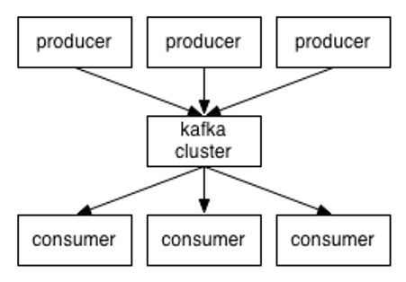
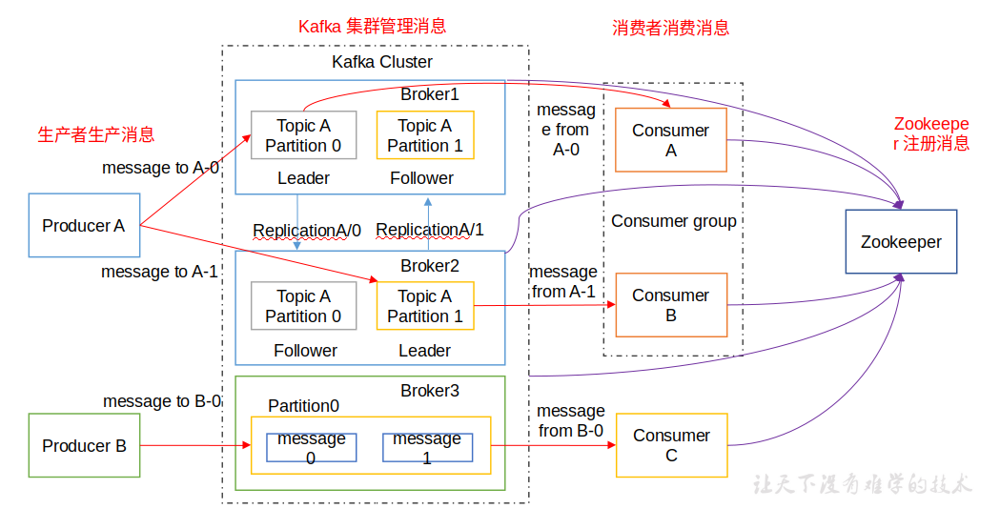
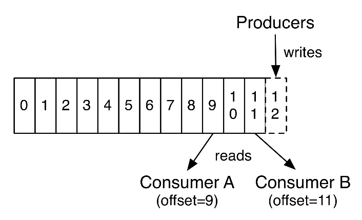
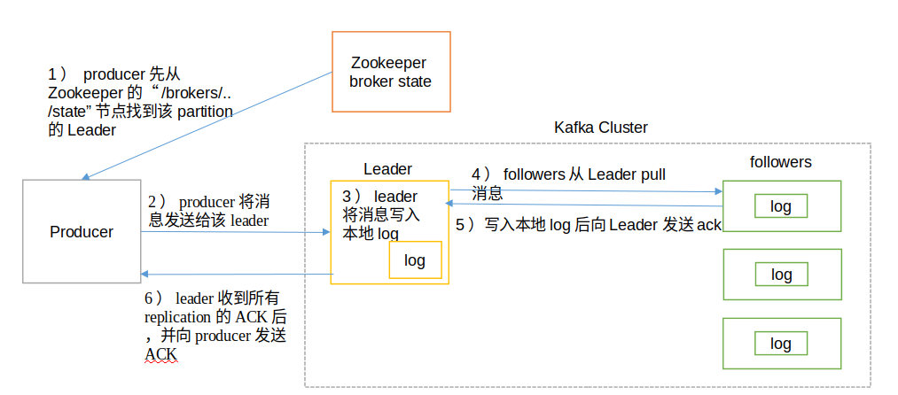
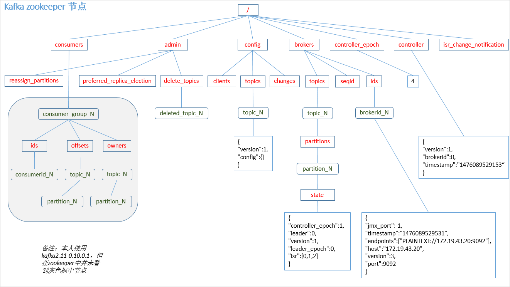
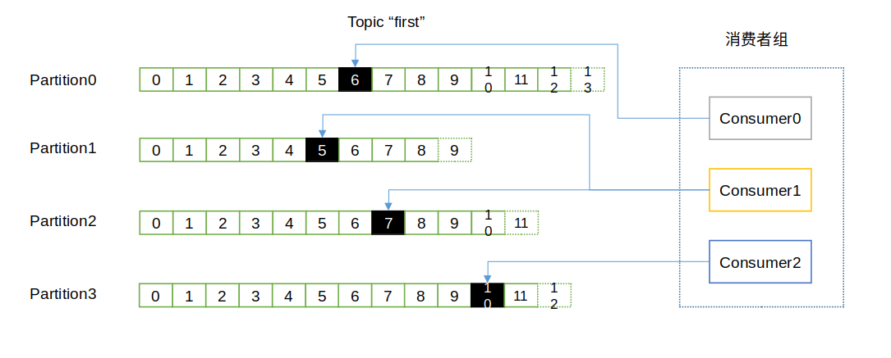
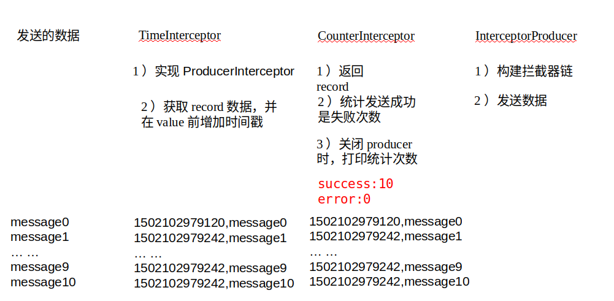

### Kafka

- 消息队列(用于解耦)内部实现原理

  

  - 点对点模式(一对一)

    基于***拉取***或者***轮询*** 。特点是发送到队列的消息被***一个且只有一个***接收者接收处理，即使有多个消息监听者也是如此。

  - 发布/订阅模式(一对多)

    基于***推送***的消息传输模型。分为临时订阅者(只在主动监听主题时才接收消息)和持久订阅者(监听主题的所有消息, 即使当前不可用, 处于离线状态)。

- Kafka定义: 

  Kafka 主要是用于缓存数据 (Scala编写) 是一个分布式的消息队列(端口: 2181)

  - 根据**Topic** 进行分类, 发送方称为 **Producer** 接收方称为**Consumer** 。

    > **Kafka 集群**有多个Kafka**实例**组成, 每个实例(Server)称为**broker(注意broker.id 不可以重复)**。无论是集群还是consumer都依赖于zookeeper中的meta信息

  - kafka 架构

    

    

    > Partition：为了实现扩展性，一个非常大的topic可以分布到多个broker（即服务器）上。
    >
    > 一个**topic**可以分为多个**partition**，每个**partition**是一个有序的**队列**。
    >
    > partition中的每条消息都会被分配一个**有序的id**（offset）。
    >
    > kafka只保证按一个partition中的**顺序**将消息发给**consumer**，**不保证**一个topic的**整体**（多个partition间）的顺序

  - Kafka 命令行操作:

    1. 查看所有topic

       ```shell
       bin/kafka-topics.sh --zookeeper hadoop102:2181 --list
       ```

    2. 创建topic

       ```shell
       bin/kafka-topics.sh --zookeeper hadoop102:2181 --create --topic first --partitions 1 --replication-factor 3 
       ```

    3. 删除topic

       ```shell
       bin/kafka-topics.sh --zookeeper hadoop102:2181 --delete --topic first
       ```

       > 需要在server.properties中设置delete.topic.enable = true 否则只是标记删除

    4. 发送消息

       ```shell
       bin/kafka-console-producer.sh --broker-list hadoop102:9092 --topic first
       >hello world
       >fxxku  fxxku
       ```

    5. 消费消息

       ```shell
       bin/kafka-console-consumer.sh --zookeeper hadoop102:2181 --from-beginning --topic first
       ```

       > --from-begining 会把first主题中之前所有的数据都读取出来(根据业务选择是否开启)

    6. 查看某个topic详情

       ```shell
       bin/kafka-topics.sh --zookeeper hadoop102:2181 --describe --topic first
       ```

- Kafka工作流程分析:

  

  - 生产过程分析:

    1. 写入方式: 

       push(producer) -> broker -> append -> partition (顺序写磁盘)

       > 顺序写磁盘比随机写内存的效率更高 保证Kafka吞吐率

    2. 分区(partition):

       消息发送的时候都被发送到一个topic (本质是一个目录)中, 而topic是由一些partition log组成。

       

       

       > partition消息是**有序的**， 生产的消息都有一个唯一的**offset值** ，分区是为了方便在集群中扩展
       >
       > 分区原则: 
       >
       > 1) 指定了patition，则直接使用 
       >
       > 2) 未指定patition但指定key，通过对key的value进行hash出一个patition 
       >
       > 3) patition和key都未指定，使用轮询选出一个patition。

       

    3. 副本(replication)

       为了防止broker宕机而所有的partition不可消费。

       引入replication之后，同一个partition可能会有多个replication，而这时需要在这些replication之间选出一个**leader**，producer和consumer只与这个**leader交互**，其它replication作为follower从leader 中复制数据。

    4. producer 生产流程:

    

  - Borker保存消息

    1. 物理上把topic分成一个或多个patition（

       > 对应 server.properties 中的 num.partitions=3配置）
       >
       > 每个patition物理上对应一个**文件夹**（该文件夹存储该patition的所有消息和索引文件）

    2. 存储策略: 

       基于时间、基于大小

    3. zookeeper 存储结构

       

  - 消费过程分析 (高级API和低级API)

    1. 高级API

       不用管理offset(通过zookeeper自行管理，记录上次的offset,  默认是1分钟更新一次offset)

       不用管理分区、副本(系统自动管理)

    2. 低级API

       可以自己控制offset (妈妈再也不用担心我的offset， 想读哪里读哪里, 对zookeeper的依赖性降低)

    3. 消费者组 (消费一个topic, 每个partition 同一时间只能由group中的一个消费者读取 ) 

       

    4. 消费方式

       **pull(拉)**模式从broker中自主读取数据

       > 根据consumer的消费能力 以适合的速率消费消息
       >
       > 为了防止在pull的时候 broker没有数据 ，在pull中加入参数(等待给定的字节数) 允许消费者请求等待数据到达的"长轮询"中进行阻塞

- Kafka API 

  启动zookeeper和一个kafka消费者

  ```shell
  $ bin/kafka-console-consumer.sh --zookeeper hadoop102:2181 --topic first
  ```

  导入pom

  ```xml
  <dependencies>
      <!-- https://mvnrepository.com/artifact/org.apache.kafka/kafka-clients -->
      <dependency>
          <groupId>org.apache.kafka</groupId>
          <artifactId>kafka-clients</artifactId>
          <version>0.11.0.0</version>
      </dependency>
      <!-- https://mvnrepository.com/artifact/org.apache.kafka/kafka -->
      <dependency>
          <groupId>org.apache.kafka</groupId>
          <artifactId>kafka_2.12</artifactId>
          <version>0.11.0.0</version>
      </dependency>
  </dependencies>
  ```

  - 生产者

    ```java
    import java.util.Properties;
    import org.apache.kafka.clients.producer.Callback;
    import org.apache.kafka.clients.producer.KafkaProducer;
    import org.apache.kafka.clients.producer.ProducerRecord;
    import org.apache.kafka.clients.producer.RecordMetadata;
    
    public class CallBackProducer { // 带回调函数的生产者
    	public static void main(String[] args) {
    		Properties props = new Properties();
    		// Kafka服务端的主机名和端口号
    		props.put("bootstrap.servers", "hadoop103:9092");
    		// 等待所有副本节点的应答
    		props.put("acks", "all");
    		// 消息发送最大尝试次数
    		props.put("retries", 0);
    		// 一批消息处理大小
    		props.put("batch.size", 16384);
    		// 增加服务端请求延时
    		props.put("linger.ms", 1);
    // 发送缓存区内存大小
    		props.put("buffer.memory", 33554432);
    		// key序列化
    		props.put("key.serializer", "org.apache.kafka.common.serialization.StringSerializer");
    		// value序列化
    		props.put("value.serializer", "org.apache.kafka.common.serialization.StringSerializer");
    
    		KafkaProducer<String, String> kafkaProducer = new KafkaProducer<>(props);
    
    		for (int i = 0; i < 50; i++) {
    
    			kafkaProducer.send(new ProducerRecord<String, String>("first", "hello" + i), new Callback() {
    
    				@Override
    				public void onCompletion(RecordMetadata metadata, Exception exception) {
    
    					if (metadata != null) {
    
    						System.err.println(metadata.partition() + "---" + metadata.offset());
    					}
    				}
    			});
    		}
    
    		kafkaProducer.close();
    	}
    }
    ```

    

  - 消费者

    创建发送者

    ```shell
    $ bin/kafka-console-producer.sh --broker-list hadoop102:9092 --topic first
    >hello world
    ```

    创建消费者

    ```java
    import java.util.Arrays;
    import java.util.Properties;
    import org.apache.kafka.clients.consumer.ConsumerRecord;
    import org.apache.kafka.clients.consumer.ConsumerRecords;
    import org.apache.kafka.clients.consumer.KafkaConsumer;
    
    public class CustomNewConsumer {
    
    	public static void main(String[] args) {
    
    		Properties props = new Properties();
    		// 定义kakfa 服务的地址，不需要将所有broker指定上 
    		props.put("bootstrap.servers", "hadoop102:9092");
    		// 制定consumer group 
    		props.put("group.id", "test");
    		// 是否自动确认offset 
    		props.put("enable.auto.commit", "true");
    		// 自动确认offset的时间间隔 
    		props.put("auto.commit.interval.ms", "1000");
    		// key的序列化类
    		props.put("key.deserializer", "org.apache.kafka.common.serialization.StringDeserializer");
    		// value的序列化类 
    		props.put("value.deserializer", "org.apache.kafka.common.serialization.StringDeserializer");
    		// 定义consumer 
    		KafkaConsumer<String, String> consumer = new KafkaConsumer<>(props);
    		
    		// 消费者订阅的topic, 可同时订阅多个 
    		consumer.subscribe(Arrays.asList("first", "second","third"));
    
    		while (true) {
    			// 读取数据，读取超时时间为100ms 
    			ConsumerRecords<String, String> records = consumer.poll(100);
    			
    			for (ConsumerRecord<String, String> record : records)
    				System.out.printf("offset = %d, key = %s, value = %s%n", record.offset(), record.key(), record.value());
    		}
    	}
    }
    ```

    > 对于**老**的消费者，由**--zookeeper参数**设置 (consumer的信息将会存放在zk之中)
    >
    > 对于**新**的消费者，由**--bootstrap-server参数**设置 (consumer的信息将会存放在kafka之中)

- 拦截器(Interceptor)

  对于Producer: 在发送消息前可以**修改消息**(如果有多个拦截器, 可以形成一个**拦截器链**)

  - 案例:

    实现一个简单的**双interceptor**组成的**拦截链**。

    第一个interceptor会在消息发送前将**时间戳**信息加到消息**value的最前部**；

    第二个interceptor会在消息发送后更新**成功**发送消息数或**失败**发送**消息数**。

    

    1. 时间拦截器

    ```java
    import java.util.Map;
    import org.apache.kafka.clients.producer.ProducerInterceptor;
    import org.apache.kafka.clients.producer.ProducerRecord;
    import org.apache.kafka.clients.producer.RecordMetadata;
    
    public class TimeInterceptor implements ProducerInterceptor<String, String> {
    
    	@Override
    	public void configure(Map<String, ?> configs) {
    
    	}
    
    	@Override
    	public ProducerRecord<String, String> onSend(ProducerRecord<String, String> record) {
    		// 创建一个新的record，把时间戳写入消息体的最前部
    		return new ProducerRecord(record.topic(), record.partition(), record.timestamp(), record.key(),
    				System.currentTimeMillis() + "," + record.value().toString());
    	}
    
    	@Override
    	public void onAcknowledgement(RecordMetadata metadata, Exception exception) {
    
    	}
    
    	@Override
    	public void close() {
    
    	}
    }
    ```

    2. 发送消息成功和发送失败消息数，并在producer**关闭时**打印这两个计数器

    ```java
    import java.util.Map;
    import org.apache.kafka.clients.producer.ProducerInterceptor;
    import org.apache.kafka.clients.producer.ProducerRecord;
    import org.apache.kafka.clients.producer.RecordMetadata;
    
    public class CounterInterceptor implements ProducerInterceptor<String, String>{
        private int errorCounter = 0;
        private int successCounter = 0;
    
    	@Override
    	public void configure(Map<String, ?> configs) {
    		
    	}
    
    	@Override
    	public ProducerRecord<String, String> onSend(ProducerRecord<String, String> record) {
    		 return record;
    	}
    
    	@Override
    	public void onAcknowledgement(RecordMetadata metadata, Exception exception) {
    		// 统计成功和失败的次数
            if (exception == null) {
                successCounter++;
            } else {
                errorCounter++;
            }
    	}
    
    	@Override
    	public void close() {
            // 保存结果
            System.out.println("Successful sent: " + successCounter);
            System.out.println("Failed sent: " + errorCounter);
    	}
    }
    ```

    3. producer主程序

    ```java
    import java.util.ArrayList;
    import java.util.List;
    import java.util.Properties;
    import org.apache.kafka.clients.producer.KafkaProducer;
    import org.apache.kafka.clients.producer.Producer;
    import org.apache.kafka.clients.producer.ProducerConfig;
    import org.apache.kafka.clients.producer.ProducerRecord;
    
    public class InterceptorProducer {
    
    	public static void main(String[] args) throws Exception {
    		// 1 设置配置信息
    		Properties props = new Properties();
    		props.put("bootstrap.servers", "hadoop102:9092");
    		props.put("acks", "all");
    		props.put("retries", 0);
    		props.put("batch.size", 16384);
    		props.put("linger.ms", 1);
    		props.put("buffer.memory", 33554432);
    		props.put("key.serializer", "org.apache.kafka.common.serialization.StringSerializer");
    		props.put("value.serializer", "org.apache.kafka.common.serialization.StringSerializer");
    		
    		// 2 构建拦截链
    		List<String> interceptors = new ArrayList<>();
    		interceptors.add("com.atguigu.kafka.interceptor.TimeInterceptor"); 				interceptors.add("com.atguigu.kafka.interceptor.CounterInterceptor"); 
    		props.put(ProducerConfig.INTERCEPTOR_CLASSES_CONFIG, interceptors);
    		 
    		String topic = "first";
    		Producer<String, String> producer = new KafkaProducer<>(props);
    		
    		// 3 发送消息
    		for (int i = 0; i < 10; i++) {
    			
    		    ProducerRecord<String, String> record = new ProducerRecord<>(topic, "message" + i);
    		    producer.send(record);
    		}
    		 
    		// 4 一定要关闭producer，这样才会调用interceptor的close方法
    		producer.close();
    	}
    }
    ```

- Kafka Stream

  


