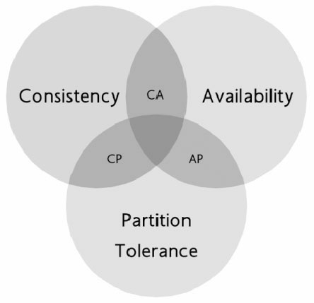
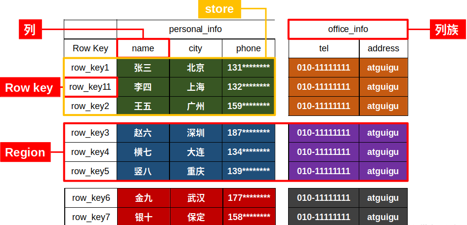
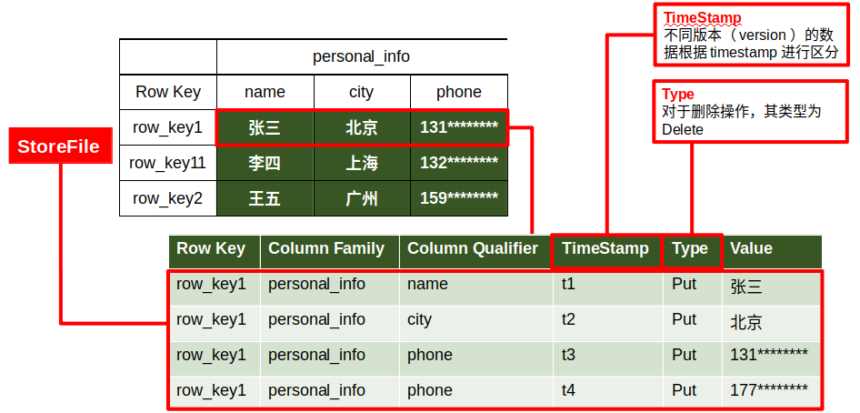
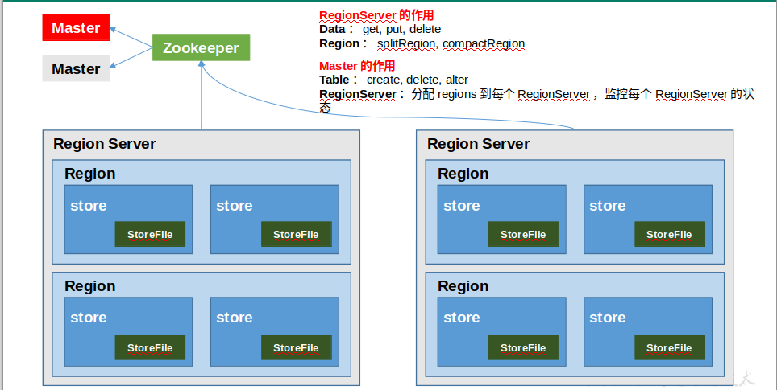
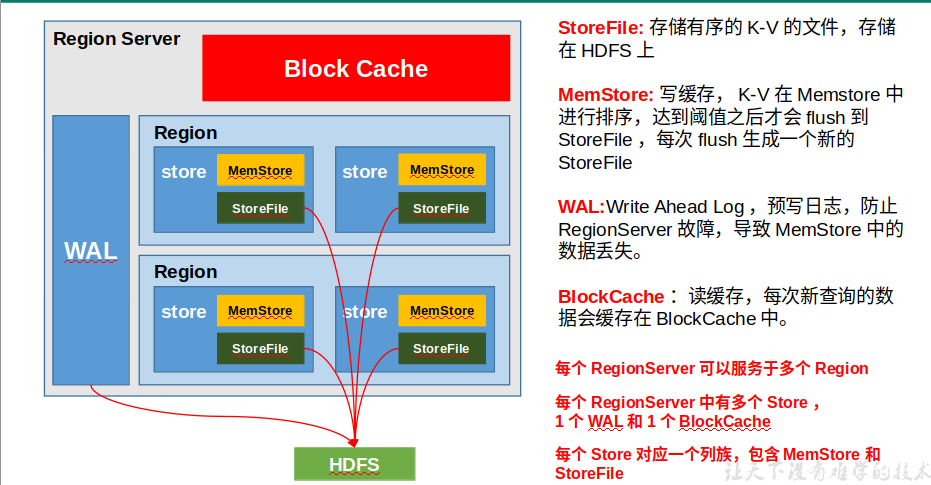

### HBase

- NOSQL(Not Only SQL)

  高并发的更新(插入、修改、删除)、多表关联后的复杂查询(order by、group by)

  - CAP 定理:

    > 背景: 解决数据库压力的一个好方法是分摊压力，即扩展为**分布式**的数据库。但是，可能会带来一些原子性的问题。没有原子性，事务就无从谈起了，关系型数据库也就失去了存在的意义。

    20世纪90年代初期Berkerly大学有位Eric Brewer教授提出了一个**CAP理论**。

    全称是**Consistency Availability and Partition tolerance**。

    - Consistency（强一致性）：数据更新操作的一致性，所有数据变动都是同步的。
    - Availability（高可用性）：良好的响应性能。
    - Partition tolerance（高分区容错性）：可靠性。

    > 教授说只能满足其中的两点， 没法让三者全部满足。架构师们应该适当的进行取舍

    

  - NOSQL

    数据库的**最终一致性**: 即数据的操作存在**延迟**(有时候是不被允许的) 因此推出了NOSQL(非关系型数据库)的概念。

- HBase

  基于BigTable论文研发了BigTable的Java开源版本, 即HBase.

  

  - **分布式**、**可扩展**、**支持海量数据存储**的NOSQL数据库。面向**列存储**(即列族，列族下可以有很多的列，需要在建表的时候指定)， 构建于Hadoop之上，提供对1**0亿级别**表数据的快速随机实时读写。

  - 逻辑架构

    

  - 物理存储架构

    

  - HBase架构

    

    1. Region Server

       RegionServer是一个服务，负责多个Region的管理。其实现类为**HRegionServer**

       主要作用如下:

       对于**数据**的操作：**get, put, delete**；

       对于**Region**的操作：**splitRegion**、**compactRegion**。

       **客户端**从**ZooKeeper**获取**RegionServer**的地址，从而调用相应的服务，获取数据。

    2. Master

       Master是所有Region Server的管理者，其实现类为**HMaster**

       主要作用如下：

       对于**表**的操作：**create, delete, alter**，这些操作可能需要跨**多个ReginServer**，因此需要Master来进行协调！

       对于**RegionServer**的操作：分配regions到每个RegionServer，监控每个RegionServer的状态，**负载均衡**和**故障转移**。

       > 即使Master进程宕机，集群依然可以执行数据的读写，只是不能进行表的创建和修改等操作！
       >
       > 当然Master也不能宕机太久，有很多必要的操作，比如创建表、修改列族配置，以及更重要的分割和合并都需要它的操作。

    3. ZooKeeper

       RegionServer非常依赖ZooKeeper服务，ZooKeeper管理了HBase所有RegionServer的信息，包括具体的数据段存放在哪个RegionServer上。

       客户端每次与HBase连接，其实都是先与ZooKeeper通信，查询出哪个RegionServer需要连接，然后再连接RegionServer。Zookeeper中记录了读取数据所需要的**元数据表**hbase:meata,因此关闭Zookeeper后，客户端是无法实现读操作的！

       > HBase通过Zookeeper来做master的高可用、RegionServer的监控、元数据的入口以及集群配置的维护等工作。

    4. HDFS

       **HDFS**为Hbase提供最终的底层**数据存储服务**，同时为HBase提供高可用的支持。

- HBase 安装、启动

  - 启动Zookeeper、Hadoop、解压HBase、配置

  - 启动HBase // 需要同步时间服务

    ```shell
    bin/HBase-daemon.sh start regionserver
    ```

  - Hbase 页面: http://hadoop101:16010

  - Shell 操作和其他操作

    ```shell
    bin/HBase shell
    status // 查看集群状态
    version // 查看版本
    whoami // 查看操作用户及组信息
    table_help // 查看操作信息
    help // 查看帮助信息
    help 'get' // 查看帮助命令
    ```

  - 表操作

    - list

    - create: 

      create '表名', { NAME => '列族名1', 属性名 => 属性值}, {NAME => '列族名2', 属性名 => 属性值}, … 

      create 'student','info'

    - desc/describe: 描述表

    - disable: 对表进行维护或者修改的前必须停用

    - enable: 启用表

    - exits: 判断是否存在

    - count

    - drop: 删除表 删除之前必须停用

    - truncate: 截断表

    - get_split: 获取表对应的Region数。刚开始只有一个region

    - alter: 修改表的属性(通常是某个列的属性)

  - 数据操作

    - scan:  可以按照rowkey的字典顺序来遍历指定的表的数据.

      ```shell
      scan 'student'
      scan 'student',{STARTROW => '1001', STOPROW  => '1001'}
      scan 'student',{STARTROW => '1001'}
      ```

    - put: 可以新增记录还可以为记录设置属性。

      ```shell
      put 'student','1001','info:name','Nick'
      put 'student','1001','info:sex','male'
      put 'student','1001','info:age','18'
      put 'student','1002','info:name','Janna'
      put 'student','1002','info:sex','female'
      put 'student','1002','info:age','20'
      ```

    - get: 支持scan所支持的大部分属性。

    - delete: 删除rowkey 的全部(某一列) 数据

- HBase 进阶

  - RegionServer架构

    

  - 写流程

    

    > 1）Client先访问**zookeeper**，获取hbase:meta表位于哪个Region Server。
    >
    > 2）访问对应的Region Server，获取hbase:meta表，根据读请求的namespace:table/rowkey，查询出目标数据位于哪个Region Server中的哪个Region中。并将该table的region信息以及meta表的位置信息**缓存**在客户端的meta cache，方便下次访问。
    >
    > 3）与目标Region Server进行通讯；
    >
    > 4）将数据顺序写入（追加）到**WA**L；
    >
    > 5）将数据写入对应的MemStore，数据会在MemStore进行排序；
    >
    > 6）向客户端**发送ack**；
    >
    > 7）等达到MemStore的刷写时机后，将数据刷写到HFile。

  - 写流程

    

    > 1）Client先访问zookeeper，获取hbase:meta表位于哪个Region Server。
    >
    > 2）访问对应的Region Server，获取hbase:meta表，根据读请求的namespace:table/rowkey，查询出目标数据位于哪个Region Server中的哪个Region中。并将该table的region信息以及meta表的位置信息缓存在客户端的meta cache，方便下次访问。
    >
    > 3）与目标Region Server进行通讯；
    >
    > 4）分别在**Block Cache（读缓存），MemStore和Store File（HFile）**中查询目标数据，并将查到的所有数据进行**合并**。此处所有数据是指同一条数据的不同版本（time stamp）或者不同的类型（Put/Delete）。
    >
    > 5）将查询到的数据块（Block，HFile数据存储单元，默认大小为64KB）缓存到Block Cache。
    >
    > 6）将合并后的最终结果返回给客户端。

  - 

  - 

  

- a
- a
- a
- a

- a
- a
- 