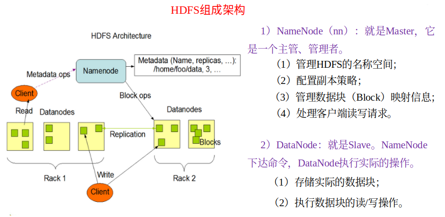

### HDFS 

Hadoop Distributed File System 是分布式文件管理系统的一种: 用于**存储**和**管理(通过目录树来定位)多台机器**上的文件. 


特点: 适合**一次**写入 **多次**读出 **不支持**文件的修改。适用于做**数据分析**


HDFS的架构: 



> 注意: Secondary NameNode 不能作为热备 当NameNode挂的时候 不能立刻换掉NameNode 并提供服务

优点: 

​	(1) 容错性高:  副本可以自动**保存**和**恢复**

​	(2) 适合处理大数据 **数据规模**(PB级) 和**文件规模**(百万)

​	(3) 可构建在**廉价机器**上


缺点:

​	(1) 访问数据的**延时**比较高(做不到毫秒级别)

​	(2) 不支持对文件的**随机写**

> 可支持追加 却不能修改 。
>
> 原因: HDFS 是以块进行存储 修改一个块的话 会影响到当前块之后的所有块 效率较低 其次是HDFS不提供在线寻址的功能

​	(3) 不是用于对**小文件**的存储(会占用大量的NameNode内存 用于存储 文件的属性和信息以及块的映射信息 NameNode 的内存是有限的) 

> 例子: 当前运行NN的机器，有64G内存，除去系统开销，分配给NN50G内存！
>
> 文件a (1k), 存储到HDFS上，需要将a文件的元数据保存到NN，加载到内存
>
> ​		文件名  创建时间  所属主  所属组 权限 修改时间+ 块的映射(1块)
>
> ​		150B   最多存储50G/150B个文件a    50G/150B * 1k
>
> 文件b (128M), 存储到HDFS上，需要将b文件的元数据保存到NN，加载到内存
> 		文件名  创建时间  所属主  所属组 权限 修改时间+块的映射(1块)
>
> ​		150B   最多存储50G/150B个文件b   50G/150B * 128M

​	(4) 只支持同时一个线程(客户端)的写


**HDFS 块的大小 ! !**


>  默认为128M 基于最佳传输损耗理论 在一次传输中，寻址时间占用总传输时间的1%时，本次传输的损耗最小，为最佳性价比传输！

不可以设置太小也不可以设置太大(取决于**磁盘传输速率**): 

​	(1) 太小: 增加寻址时间

​	(2) 太大:  导致磁盘的传输数据时间会明显大于定位这个块所需要的时间 处理的时候很慢

>举例: 
>
>太小：
>			文件a,128M
>			1M一块：  128个块，生成128个块的映射信息
>			128M一块， 1个块，一个块的映射信息
>			①块太小，同样大小的文件，会占用过多的NN的元数据空间
>			②块太小，在进行读写操作时，会消耗额外的寻址时间
>
>太大：  
>			当前有文件a, 1G
>			128M一块  1G存8块   ， 取第一块
>			1G一块       1G存1块   ， 取第一块
>			只需要读取a文件0-128M部分的内容
>			①在一些分块读取的场景，不够灵活，会带来额外的网络消耗
>			②在上传文件时，一旦发生故障，会造成资源的浪费


**HDFS的Shell操作**

先启动Hadoop 集群

```shell
start-dfs.sh
start-yarn.sh
```

```shell
hadoop fs -help 
```

设置副本数量(指最大副本数)

```shell
hadoop fs -setrep 5 /aaa/bbb/ccc.txt # 既可以对本地文件系统进行操作还可以操作分布式文件系统！
hdfs dfs # 只能操作分布式文件系统
```

这里设置的副本数只是记录在**NameNode**的元数据中，是否真的会有这么多副本，还得看**DataNode**的数量。

默认块大小为128M，128M指的是块的最大大小！每个块最多存储128M的数据，如果当前块存储的数据不满128M。存了多少数据，就占用多少的磁盘空间！一个块只属于一个文件！

因为目前只有3台设备，最多也就3个副本，只有节点数的增加到10台时，副本数才能达到10。


**HDFS客户端的操作**

- 服务端: 启动NN DN 

- 将Win10编译后的hadoop解压到没有空格的目录

- 设置HADOOP_HOME 环境变量(D:\Dev\hadoop-2.7.2)和Path环境变量(D:\Dev\hadoop-2.7.2\bin D:\Dev\hadoop-2.7.2\sbin)

- 创建maven工程 并配置 log4j.properties

- 创建包名和TestHDFS类

  - 创建目录

  ```java
  public class TestHDFS{	
  @Test
  public void testMkdirs() throws IOException, InterruptedException, URISyntaxException{
  		
  		// 1 获取文件系统
  		Configuration configuration = new Configuration();
  		// 配置在集群上运行
  		// configuration.set("fs.defaultFS", "hdfs://hadoop101:9000");
  		// FileSystem fs = FileSystem.get(configuration);
  
  		FileSystem fs = FileSystem.get(new URI("hdfs://hadoop101:9000"), configuration, "sherlock");
  		
  		// 2 创建目录
  		fs.mkdirs(new Path("/aaa/bbb/ccc"));
  		
  		// 3 关闭资源
  		fs.close();
  	}
  }
  ```

  - 文件上传

  ```java
  @Test
  public void testCopyFromLocalFile() throws IOException, InterruptedException, URISyntaxException {
  		// 1 获取文件系统
  		Configuration configuration = new Configuration();
  		configuration.set("dfs.replication", "2");
  		FileSystem fs = FileSystem.get(new URI("hdfs://hadoop102:9000"), configuration, "sherlock");
  
  		// 2 上传文件
  		fs.copyFromLocalFile(new Path("d:/aaa.txt"), new Path("/aaa.txt"));
  
  		// 3 关闭资源
  		fs.close();
  
  		System.out.println("upload over");
  }
  ```

  - 拷贝hdfs-site.xml 到项目的根目录

    ```xml
    <?xml version="1.0" encoding="UTF-8"?>
    <?xml-stylesheet type="text/xsl" href="configuration.xsl"?>
    
    <configuration>
    	<property>
    		<name>dfs.replication</name>
            <value>1</value>
    	</property>
    </configuration>
    ```

  - 参数优先级 

    1）客户端代码中设置的值 >（2）ClassPath下的用户自定义配置文件 >（3）然后是服务器的默认配置

  - 文件下载

    ```java
    @Test
    public void testCopyToLocalFile() throws IOException, InterruptedException, URISyntaxException{
    		// 1 获取文件系统
    		Configuration configuration = new Configuration();
    		FileSystem fs = FileSystem.get(new URI("hdfs://hadoop102:9000"), configuration, "sherlock");
    		
    		// 2 执行下载操作
    		// boolean delSrc 指是否将原文件删除
    		// Path src 指要下载的文件路径
    		// Path dst 指将文件下载到的路径
    		// boolean useRawLocalFileSystem 是否开启文件校验
    		fs.copyToLocalFile(false, new Path("/aaa.txt"), new Path("d:/aaa.txt"), true);
    		
    		// 3 关闭资源
    		fs.close();
    }
    ```

  - 文件夹删除

    ```java
    @Test
    public void testDelete() throws IOException, InterruptedException, URISyntaxException{
    	// 1 获取文件系统
    	Configuration configuration = new Configuration();
    	FileSystem fs = FileSystem.get(new URI("hdfs://hadoop102:9000"), configuration, "sherlock");
    		
    	// 2 执行删除
    	fs.delete(new Path("/aaa/"), true);
    		
    	// 3 关闭资源
    	fs.close();
    }
    ```

  - 文件名更改

    ```java
    @Test
    public void testRename() throws IOException, InterruptedException, URISyntaxException{
    	// 1 获取文件系统
    	Configuration configuration = new Configuration();
    	FileSystem fs = FileSystem.get(new URI("hdfs://hadoop102:9000"), configuration, "sherlock"); 
    		
    	// 2 修改文件名称
    	fs.rename(new Path("/aaa.txt"), new Path("/aaa.txt"));
    		
    	// 3 关闭资源
    	fs.close();
    }
    ```

  - 文件详情查看

    ```java
    @Test
    public void testListFiles() throws IOException, InterruptedException, URISyntaxException{
    	// 1获取文件系统
    	Configuration configuration = new Configuration();
    	FileSystem fs = FileSystem.get(new URI("hdfs://hadoop102:9000"), configuration, "sherlock"); 
    		
    	// 2 获取文件详情
    	RemoteIterator<LocatedFileStatus> listFiles = fs.listFiles(new Path("/"), true);
    		
    	while(listFiles.hasNext()){
    		LocatedFileStatus status = listFiles.next();
    			
    		// 输出详情
    		// 文件名称
    		System.out.println(status.getPath().getName());
    		// 长度
    		System.out.println(status.getLen());
    		// 权限
    		System.out.println(status.getPermission());
    		// 分组
    		System.out.println(status.getGroup());
    			
    		// 获取存储的块信息
    		BlockLocation[] blockLocations = status.getBlockLocations();
    			
    		for (BlockLocation blockLocation : blockLocations) {
    				
    			// 获取块存储的主机节点
    			String[] hosts = blockLocation.getHosts();
    				
    			for (String host : hosts) {
    				System.out.println(host);
    			}
    		}
    			
    		System.out.println("-----------分割线----------");
    	}
    // 3 关闭资源
    fs.close();
    }
    ```

  - 文件和文件夹的判断

    ```java
    @Test
    public void testListStatus() throws IOException, InterruptedException, URISyntaxException{
    		
    	// 1 获取文件配置信息
    	Configuration configuration = new Configuration();
    	FileSystem fs = FileSystem.get(new URI("hdfs://hadoop102:9000"), configuration, "sherlock");
    		
    	// 2 判断是文件还是文件夹
    	FileStatus[] listStatus = fs.listStatus(new Path("/"));
    		
    	for (FileStatus fileStatus : listStatus) {
    			
    		// 如果是文件
    		if (fileStatus.isFile()) {
    				System.out.println("f:"+fileStatus.getPath().getName());
    			}else {
    				System.out.println("d:"+fileStatus.getPath().getName());
    			}
    		}
    		
    	// 3 关闭资源
    	fs.close();
    }
    ```

- HDFS的I/O操作(自定义上传文件)

  - 上传

    ```java
    @Test
    public void putFileToHDFS() throws IOException, InterruptedException, URISyntaxException {
    	// 1 获取文件系统
    	Configuration configuration = new Configuration();
    	FileSystem fs = FileSystem.get(new URI("hdfs://hadoop102:9000"), configuration, "sherlock");
    
    	// 2 创建输入流
    	FileInputStream fis = new FileInputStream(new File("e:/aaa.txt"));
    
    	// 3 获取输出流
    	FSDataOutputStream fos = fs.create(new Path("/aaa.txt"));
    
    	// 4 流对拷
    	IOUtils.copyBytes(fis, fos, configuration);
    
    	// 5 关闭资源
    	IOUtils.closeStream(fos);
    	IOUtils.closeStream(fis);
        fs.close();
    }
    ```

    

  - 下载

    ```java
    // 文件下载
    @Test
    public void getFileFromHDFS() throws IOException, InterruptedException, URISyntaxException{
    	// 1 获取文件系统
    	Configuration configuration = new Configuration();
    	FileSystem fs = FileSystem.get(new URI("hdfs://hadoop102:9000"), configuration, "sherlock");
    		
    	// 2 获取输入流
    	FSDataInputStream fis = fs.open(new Path("/aaa.txt"));
        
        // 3 获取输出流
    	FileOutputStream fos = new FileOutputStream(new File("e:/aaa.txt"));
    		
    	// 4 流的对拷
    	IOUtils.copyBytes(fis, fos, configuration);
    		
    	// 5 关闭资源
    	IOUtils.closeStream(fos);
    	IOUtils.closeStream(fis);
    	fs.close();
    }
    ```

    

  - 文件定位读取(分成很多块)

    下载第一块

    ```java
    @Test
    public void readFileSeek1() throws IOException, InterruptedException, URISyntaxException{
    	// 1 获取文件系统
    	Configuration configuration = new Configuration();
    	FileSystem fs = FileSystem.get(new URI("hdfs://hadoop102:9000"), configuration, "sherlock");
    		
    	// 2 获取输入流
    	FSDataInputStream fis = fs.open(new Path("/hadoop-2.7.2.tar.gz"));
    		
    	// 3 创建输出流
    	FileOutputStream fos = new FileOutputStream(new File("e:/hadoop-2.7.2.tar.gz.part1"));
    		
    	// 4 流的拷贝
    	byte[] buf = new byte[1024]; // 每次 1k
    		
    	for(int i =0 ; i < 1024 * 128; i++){
            // 1k * 1k * 128 ---> 128M
            // BLK1: 0 --- 127M
            // BLK2：128 --- 255M
            // BLK3：256 --- 383M
            // BLK4：384 --- leaf
    		fis.read(buf);
    		fos.write(buf);
    	}
    		
    	// 5关闭资源
    	IOUtils.closeStream(fis);
    	IOUtils.closeStream(fos);
    }
    ```

    下载第二块

    ```java
    @Test
    public void readFileSeek2() throws IOException, InterruptedException, URISyntaxException{
    	// 1 获取文件系统
    	Configuration configuration = new Configuration();
    	FileSystem fs = FileSystem.get(new URI("hdfs://hadoop102:9000"), configuration, "sherlock");
    		
    	// 2 打开输入流
    	FSDataInputStream fis = fs.open(new Path("/hadoop-2.7.2.tar.gz"));
    		
    	// 3 定位输入数据位置
    	fis.seek(1024*1024*128);
    		
    	// 4 创建输出流
    	FileOutputStream fos = new FileOutputStream(new File("e:/hadoop-2.7.2.tar.gz.part2"));
    		
    	// 5 流的对拷
    	IOUtils.copyBytes(fis, fos, configuration);
    		
    	// 6 关闭资源
    	IOUtils.closeStream(fis);
    	IOUtils.closeStream(fos);
    }
    ```

    

  - HDFS的数据流

    - 写数据流

      

      1）客户端通过**Distributed FileSystem**模块向**NameNode**请求上传文件，NameNode检查目标文件是否已存在，父目录是否存在。

      2）NameNode返回**是否可以上传**。

      3）客户端请求第一个 **Block**上传到哪几个**DataNode**服务器上。

      4）NameNode返回**3个DataNode**节点，分别为dn1、dn2、dn3。

      5）客户端通过**FSDataOutputStream**模块请求dn1上传数据，dn1收到请求会继续调用dn2，然后dn2调用dn3，将这个**通信管道**建立完成。

      6）dn1、dn2、dn3逐级**应答**客户端。

      7）客户端开始往dn1上传第一个**Block**（先从磁盘读取数据放到一个**本地内存缓存**），以**Packet(64K)**为单位，dn1收到一个Packet就会传给dn2，dn2传给dn3；**dn1每传一个packet会放入一个应答队列(dataQuene(待发送数据包))等待应答。**每个节点收到packet后 向客户端发送ack确认消息 

      如果一个packet 在发送后 已经收到了所有的消息那么packet会在ackqueue中删除

      如果发送后收到的DN返回ack确认消息超时 那么传输中止 packet回滚到dataQueue后重新建立通道并剔除坏的DN节点 NN自动维护副本数

      8）当一个Block传输完成之后，客户端**再次请求**NameNode上传第**二个**Block的服务器。（重复执行3-7步）。

    > 总结:
    >
    > ①服务端启动HDFS中的NN和DN进程
    > ②客户端创建一个分布式文件系统客户端，由客户端向NN发送请求，请求上传文件
    > ③NN处理请求，检查客户端是否有权限上传，路径是否合法等
    > ④检查通过，NN响应客户端可以上传
    > ⑤客户端根据自己设置的块大小，开始上传第一个块，默认0-128M,
    >   NN根据客户端上传文件的副本数(默认为3)，根据机架感知策略选取指定数量的DN节点返回
    > ⑥客户端根据返回的DN节点，请求建立传输通道
    > 	客户端向最近(网络距离最近)的DN节点发起通道建立请求，由这个DN节点依次向通道中的(距离当前DN距离最近)
    > 	下一个节点发送建立通道请求，各个节点发送响应 ，通道建立成功
    > ⑦客户端每读取64K的数据，封装为一个packet(数据包，传输的基本单位)，将packet发送到通道的下一个节点
    > 	通道中的节点收到packet之后，落盘(检验)存储，将packet发送到通道的下一个节点！
    > 	每个节点在收到packet后，向客户端发送ack确认消息！
    > ⑧一个块的数据传输完成之后，通道关闭，DN向NN上报消息，已经收到某个块
    > ⑨第一个块传输完成，第二块开始传输，依次重复⑤-⑧，直到最后一个块传输完成，NN向客户端响应传输完成！
    > 	客户端关闭输出流
    > 	

    

    ​		网络拓扑-节点距离计算

    ​		在HDFS写数据的过程中，NameNode会选择距离待上传数据最近距离的DataNode接收数据

    ​		**节点距离: 两个节点到达最近的共同祖先的距离总和**

    ​		

    

    > 在同一节点上，它们之间的距离当然是0，2*0=0
    >
    > 在同一机架上的不同节点，它们的共同祖先就是这个机架，而这两个节点到机架的距离都是1，所以这两个节点的距离为1+1=2
    >
    > 在同一集群的不同机架上的节点，它们的共同祖先是集群，而这两个节点要到达集群，首先要到这个机架(距离1)，然后到达集群(距离2)，所以两个节点的距离为2+2=4
    >
    > 在同一数据中心的不同集群上的节点，它们的共同祖先是数据中心，以此类推，一个节点到数据中心的距离是3，两个节点的距离就是3+3=6

    ​		

    ​		机架感知(副本存储节点选择)

    ​		

    ​	第二个DN节点在本地最多为2个(为了快) 第三个DN节点是为了安全性而设定

    - 读数据流

    

    1）客户端通过Distributed FileSystem向NameNode请求下载文件，NameNode通过查询元数据，找到文件块所在的DataNode地址。

    2）挑选一台DataNode（就近原则，然后随机）服务器，请求读取数据。

    3）DataNode开始传输数据给客户端（从磁盘里面读取数据输入流，以Packet为单位来做校验）。

    4）客户端以Packet为单位接收，先在本地缓存，然后写入目标文件。


NN 和 2NN 工作机制


第一阶段: NameNode 的启动

​	1) 第一次启动NameNode **格式化**后 , **创建Fsimage和Edits**文件 如果不是第一次启动，直接加载编辑日志和镜像文件到内存。

​	2) 客户端对元数据进行增删改查请求

​	3) NameNode 记录操作日志 更新**滚动日志**

​	4) NameNode **在内存**中对数据进行增删改(有点像**Redis**)


第二阶段: Secondary NameNode 的启动

​	1) Secondary NameNode询问NameNode是否需要CheckPoint。直接带回NameNode是否检查结果。

​	2) Secondary NameNode请求执行CheckPoint。

​	3) NameNode滚动正在写的Edits日志。

​	4) 将滚动前的编辑日志和镜像文件拷贝到Secondary NameNode。

​	5) Secondary NameNode加载编辑日志和镜像文件到内存，并合并。

​	6) 生成新的镜像文件fsimage.chkpoint。

​	7) 拷贝fsimage.chkpoint到NameNode。

​	8) NameNode将fsimage.chkpoint重新命名成fsimage。


> NN 和 2NN工作机制详解:
>
> Fsimage：NameNode内存中元数据序列化后形成的文件。
>
> Edits：记录客户端更新元数据信息的每一步操作（可通过Edits运算出元数据）。
>
> ----------------------------------------------------------------------------------------------------------------------------------------------------
>
> NameNode启动时，先滚动Edits并生成一个空的edits.inprogress，然后加载Edits和Fsimage到内存中，此时NameNode内存就持有最新的元数据信息。
>
> ----------------------------------------------------------------------------------------------------------------------------------------------------
>
> Client开始对NameNode发送元数据的增删改的请求，这些请求的操作首先会被记录到edits.inprogress中（查询元数据的操作不会被记录在Edits中，因为查询操作不会更改元数据信息），如果此时NameNode挂掉，重启后会从Edits中读取元数据的信息。
>
> ---
>
> NameNode会在内存中执行元数据的增删改的操作。
>
> ---
>
> 由于Edits中记录的操作会越来越多，Edits文件会越来越大，导致NameNode在启动加载Edits时会很慢，所以需要对Edits和Fsimage进行合并（所谓合并，就是将Edits和Fsimage加载到内存中，照着Edits中的操作一步步执行，最终形成新的Fsimage）。SecondaryNameNode的作用就是帮助NameNode进行Edits和Fsimage的合并工作。
>
> ---
>
> SecondaryNameNode首先会询问NameNode是否需要CheckPoint（触发CheckPoint需要满足两个条件中的任意一个，定时时间到和Edits中数据写满了）。直接带回NameNode是否检查结果。SecondaryNameNode执行CheckPoint操作，首先会让NameNode滚动Edits并生成一个空的edits.inprogress，滚动Edits的目的是给Edits打个标记，以后所有新的操作都写入edits.inprogress，其他未合并的Edits和Fsimage会拷贝到SecondaryNameNode的本地，然后将拷贝的Edits和Fsimage加载到内存中进行合并，生成fsimage.chkpoint，然后将fsimage.chkpoint拷贝给NameNode，重命名为Fsimage后替换掉原来的Fsimage。NameNode在启动时就只需要加载之前未合并的Edits和Fsimage即可，因为合并过的Edits中的元数据信息已经被记录在Fsimage中。

​	

​	Fsimage 和 Edits概念

​	格式化后: 在/opt/module/hadoop-2.7.2/data/tmp/dfs/name/current目录中产生如下文件 fsimage_000000000  fsimage_00000000000.md5 seen_txid VERSION 

​	(1) fsimage文件 HDFS文件系统元数据的一个 **永久性的检查点** (包括HDFS文件系统的所有目录和文件idnode的序列化信息)

​	(2) Edits 文件 存放HDFS文件系统的所有更新操作的路径 文件系统客户端执行的所有写操作首先会被记录到Edits文件中

​	(3) seen_txid 文件保存的是一个数字 就是最后一个edits_的数字

​	(4) 每次NameNode **启动的时候** 都会将fsimage文件读入内存 加载Edits里面的更新操作 保证内存中的元数据总是最新的 同步的 (可以看成NameNode启动的时候就将fsimage和edits文件进行了**合并**)


- **oiv** 查看 **Fsimage** 文件

  ```xml
  hdfs oiv -p 文件类型 -i镜像文件 -o 转换后文件输出路径
  ```

  实例: 

  ```xml
  hdfs oiv -p XML -i fsimage_0000000000000000025 -o /opt/module/hadoop-2.7.2/fsimage.xml
  ```

  > 在集群启动后，要求DataNode上报数据块信息，并间隔一段时间后再次上报。

  

- **oev** 查看**Edits** 文件

  ```xml
  hdfs oev -p 文件类型 -i编辑日志 -o 转换后文件输出路径
  ```

  实例:

  ```
  hdfs oev -p XML -i edits_0000000000000000012-0000000000000000013 -o /opt/module/hadoop-2.7.2/edits.xml
  ```

- CheckPoint 时间设置

  通常2NN每隔一小时 / 操作次数达到100w时 执行一次

  hdfs-default.xml

  ```xml
  <property>
    <name>dfs.namenode.checkpoint.period</name>
    <value>3600</value>
  </property >
  ```

  ```xml
  <property>
    <name>dfs.namenode.checkpoint.txns</name>
    <value>1000000</value>
  <description>操作动作次数</description>
  </property>
  ```

- NameNode 故障处理

  方法一: 

  将SecondaryNameNode中数据拷贝到NameNode存储数据的目录

  方法二: 

  使用-importCheckpoint 选项启动 NameNode 守护进程 从而将2NN 中数据拷贝到 NameNode目录中

  hdfs-site.xml

  ```xml
  <property>
    <name>dfs.namenode.checkpoint.period</name>
    <value>120</value>
  </property>
  
  <property>
    <name>dfs.namenode.name.dir</name>
    <value>/opt/module/hadoop-2.7.2/data/tmp/dfs/name</value>
  </property>
  ```

  > 如果SecondaryNameNode不和NameNode在一个主机节点上，需要将SecondaryNameNode存储数据的目录拷贝到NameNode存储数据的平级目录，并删除in_use.lock文件

  导入检查点数据

  hdfs namenode -importCheckpoint

  

- 集群安全模式

  


