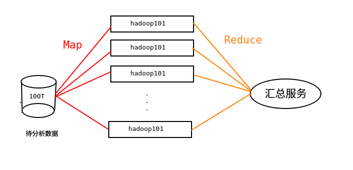

### Hadoop

由Apache基金会所开发的***分布式***系统基础架构, 解决海量数据***存储***和***计算***

三大发行版本： Apache Cloudera Hortonworks

优势：高可靠 高扩展 高效 高容错


***hadoop2.xx 组成***


- MapReduce(负责计算 负责计算资源的申请调度)  (编程模型)
  - Map ***并行***处理数据
  - Reduce 对Map结果进行***汇总***



​		

​		打包后 称为一个Job(任务) 需要提交到YARN上 向YARN申请计算资源 运行job中的Task(进程)

​		Job会先创建一个进程MRAppMaster(mapreduce 应用管理者)，由MRAppMaster向YARN申请资源！

​		MRAppMaster负责监控Job中各个Task运行情况，进行容错管理！

- YARN 架构:

  - ResourceManager(RM): 处理***客户端***请求, 启动/监控ApplicationMaster、监控NodeManager、资源分配与调度

  - NodeManager(NM): 单个结点上的资源管理、处理来自***ResourceManager***的命令、处理来自***ApplicationMaster***的命令
  - ApplicationMaster: 数据切分 为应用程序申请资源 并分配给内部任务 任务监控与容错
  - Container: 对任务运行环境的抽象 封装了CPU 内存等和任务运行相关的信息


- HDFS (负责大数据的存储) 
  - NameNode(NN): 存储文件的元数据(文件的信息属性)以及文件的块列表和块所在的DataNode等
  - DataNode(DN): 在本地文件系统存储文件块数据 和块数据的校验和
  - Secondary NameNode(2NN): 用来监控HDFS状态的辅助后台程序 并且每个一段时间获取HDFS元数据的快照


***推荐系统框剪***


***Hadoop运行模式***

本地模式、伪分布式模式、完全分布式模式

- 本地模式

- 伪分布式模式

  - ***HDFS***的安装和启动

    core-site.xml

    ```xml
    <property>
      <name>fs.defaultFS</name>
      <!-- 告知NN在哪个机器，NN使用哪个端口号接收客户端和DN的RPC请求. -->
      <value>hdfs://matrix:9000</value>
    </property>
    <property>
      <name>hadoop.tmp.dir</name>
      <value>/opt/module/hadoop-2.7.2/data/tmp</value>
    </property>
    ```

    hdfs-site.xml

    ```xml
    <!-- 指定HDFS副本的数量 -->
    <property>
    	<name>dfs.replication</name>
    	<value>1</value>
    </property>
    ```

    格式化NameNode(只需要格式化一次)

    ```
    hadoop namenode -format
    ```

    > ①生成/opt/module/hadoop-2.7.2/data/tmp目录
    > ②在目录中生成fsimage_0000000000000000000文件
    >
    > 
    >
    > 注意：格式化NameNode，会产生新的集群id,导致NameNode和DataNode的集群id不一致，集群找不到已往数据。所以，格式NameNode时，一定要先删除data数据和log日志，然后再格式化NameNode。

    启动NameNode

    ```
    hadoop-daemon.sh start namenode
    ```

    启动DataNode

    ```
    hadoop-daemon.sh start datanode
    ```

    查看

    jps 或者通过浏览器访问 http://NN所在主机名/ip:50070

  

  ​		注意: 因为 ***NameNode*** 和 ***DataNode*** 都是在同一个机器上所以称为***伪分布式***

  

  - 在YARN上运行***MapReduce***程序

    mapred-site.xml

    ```xml
    <property>
      <name>mapreduce.framework.name</name>
      <value>yarn</value>
    </property>
    ```

     yarn-site.xml

    ```xml
    <!-- reducer获取数据的方式 -->
    <property>
     		<name>yarn.nodemanager.aux-services</name>
     		<value>mapreduce_shuffle</value>
    </property>
    
    <!-- 指定YARN的ResourceManager的地址 -->
    <property>
    <name>yarn.resourcemanager.hostname</name>
    <value>matrix</value>
    </property>
    ```

    启动 RM 和 NM

    ```shell
    yarn-daemon.sh start resourcemanager
    yarn-daemon.sh start nodemanager
    ```

    查看

    jps 或者 http://RM所在主机名/ip:8088

  

  > 配置文件说明: 
  >
  > 默认配置文件和自定义配置文件，只有用户想修改某一默认配置值时，才需要修改自定义配置文件，更改相应属性值。
  >
  > 
  >
  > 默认配置文件
  >
  > core-default.xml 		hadoop-common-2.7.2.jar/ core-default.xml
  >
  > hdfs-default.xml 		hadoop-hdfs-2.7.2.jar/ hdfs-default.xml
  >
  > yarn-default.xml		 hadoop-yarn-common-2.7.2.jar/ yarn-default.xml
  >
  > mapred-default.xml   hadoop-mapreduce-client-core-2.7.2.jar/ mapred-default.xml
  >
  > 
  >
  > 自定义配置文件
  >
  > core-site.xml、hdfs-site.xml、yarn-site.xml、mapred-site.xml四个配置文件存放在$HADOOP_HOME/etc/hadoop这个路径上，用户可以根据项目需求重新进行修改配置。

  

- 完全分布式模式
  


